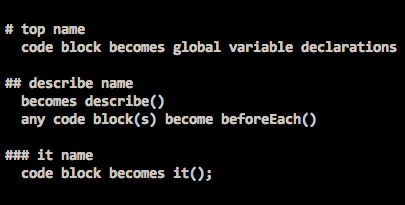
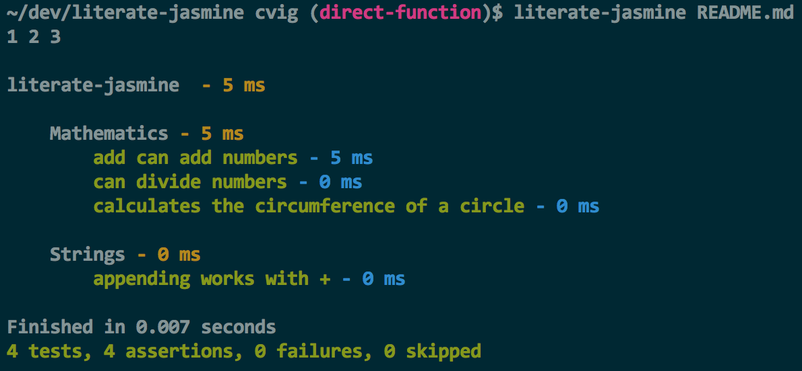

# literate-jasmine 

    var PI;

## Mathematics

    PI = 22/7;

### add can add numbers

    var a = 1,
        b = 2;

    expect(a + b).toBe(3);

### can divide numbers

    var a = 6,
        b = 2;

And a comment here doesn't break things:

    expect(a/b).toBe(3);

### calculates the circumference of a circle
Note that we reference the variable PI below that is defined in the code
block at the top of this describe (so right under "Mathematics").

    var circumference = function(radius) {
      return 2 * PI * radius;
    };

    expect(circumference(5)).toBe(2 * 22/7 * 5);

## Strings
### appending works with +

    var text = "abc";

    expect(text + "d").toBe("abcd");

## Asynchronous
### works with done

    setTimeout(function() {
      expect(true).toBe(true);
      done();
    }, 50);

The file you are currently reading has a markdown structure (which includes
the main header above and the other parts below) that is parsed into a tree:

* literate-jasmine
  * Mathematices
    * add can add numbers (level 3 header)
    * add can add numbers
    * calculates the circumference of a circle
  * Strings
    * appending works with +
  * Asynchronous
    * works with done

Which is then uses the Jasmine `describe`, `it` and `beforeEach` to setup the
tests and then run them. **Note that there is a convention -- a hard rule that
there will be a top header (top describe), one or more headers below that
(describes) and one or more header below each of those (it blocks).***

`literate-jasmine README.md`

(If you're working on this project, run `./bin/literate-jasmine` instead.)

Take a close look at how scope works for globals. In the Mathematics section below, we
reference `PI` to reset it as a `beforeEach` so every test has `PI` reset to the correct
value. The actual declaration of `PI` as a variable happens on the fourth line of this
README. The root describe treats any code blocks after it as global setup.
